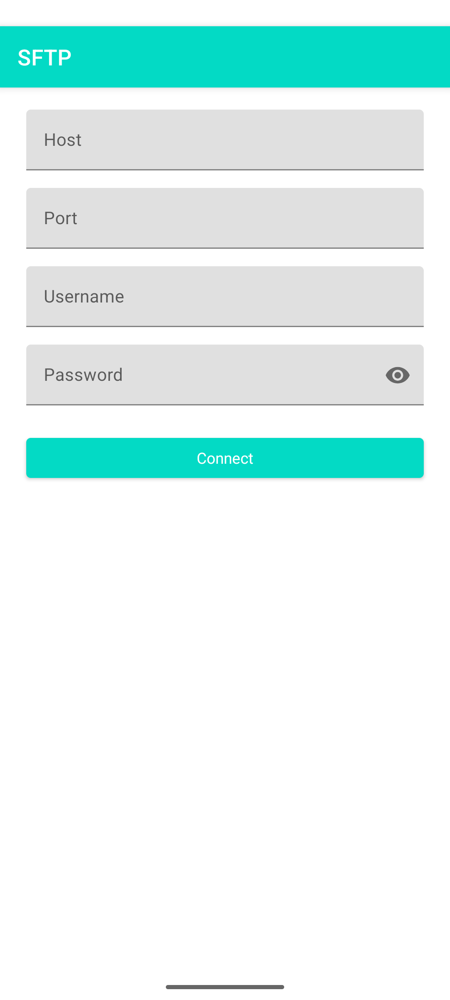
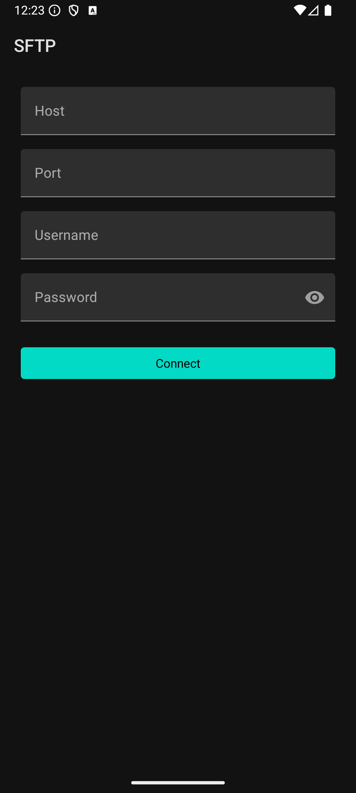

# 🚀 SFTP Exchange - Secure File Transfer Client

<p align="center">
  
  
  
  
</p>

<p align="center">
  <strong>A modern, secure Android application for SFTP file transfers with Material Design UI</strong>
</p>

---

## 📸 **Application Preview**

<p align="center">
  
  
</p>

<p align="center">
  <em>🌅 Light Mode &nbsp;&nbsp;&nbsp;&nbsp;&nbsp;&nbsp;&nbsp;&nbsp;&nbsp;&nbsp;&nbsp;&nbsp;&nbsp;&nbsp;&nbsp;&nbsp;&nbsp;&nbsp;&nbsp;&nbsp;&nbsp;&nbsp;&nbsp;&nbsp;&nbsp;&nbsp;&nbsp;&nbsp;&nbsp;&nbsp;&nbsp;&nbsp;&nbsp;&nbsp; 🌙 Dark Mode</em>
</p>

---

## 🎯 **Overview**

**SFTP Exchange** is a straightforward Android application that provides secure file transfer capabilities using the SSH File Transfer Protocol (SFTP). Built with clean Android development practices, it offers an intuitive Material Design interface with comprehensive file management features and robust SFTP connectivity.

### **🌟 Why SFTP Exchange?**
- **🛡️ Security First**: All communications are encrypted using SSH protocol via JSch library
- **📱 Clean Design**: Implements Material Components with automatic day/night theming
- **⚡ Simple & Effective**: Direct SFTP implementation without unnecessary complexity  
- **🔒 Privacy Focused**: Uses app-specific storage, no intrusive permissions
- **🎨 User Experience**: Intuitive interface with progress tracking and error handling

---

## ✨ **Key Features**

### 🔐 **Security & Authentication**
- **End-to-End Encryption**: All file transfers secured with SSH/SFTP protocol using JSch
- **Password Authentication**: Simple and secure password-based login
- **Connection Validation**: Automatic server connectivity testing
- **No Credential Storage**: Fresh authentication for each session

### � **File Management**
- **Remote Directory Navigation**: Browse server directories with clean file listing
- **Multi-File Selection**: Select multiple files with long-press functionality  
- **Upload/Download Operations**: Transfer files between device and server
- **File Type Recognition**: Visual file type indicators in listing
- **Progress Tracking**: Real-time progress dialogs for transfers

### 🎨 **User Interface**
- **Material Components**: Google's Material Design component library
- **Automatic Theming**: System-based dark/light mode switching
- **Responsive Layout**: Works across different screen sizes
- **Clean Navigation**: Simple activity-based navigation
- **Modern Progress Indicators**: Custom dialog progress displays

### 📊 **Transfer Management**
- **Real-Time Progress**: Live progress bars with detailed transfer information
- **Error Handling**: Comprehensive connection and transfer error management
- **Background Operations**: File operations run on background threads
- **Transfer Feedback**: Toast notifications and dialog confirmations

---

## 🏗️ **Technical Architecture**

### **📋 Technology Stack**
- **☕ Java 11**: Core application logic and UI implementation
- **📱 Android SDK**: Native Android development with API level 29+ (Android 10)
- **🎨 Material Components**: Google's Material Design component library
- **🔐 JSch 0.1.55**: Pure Java implementation of SSH/SFTP protocol
- **🧵 Threading**: Basic thread management for network operations

### **🏛️ Application Structure**
```
┌─────────────────────────────────────────────┐
│              UI Layer                       │
│        (Activities & Dialogs)              │
├─────────────────────────────────────────────┤
│              Adapter Layer                  │
│        (RecyclerView File Listing)         │
├─────────────────────────────────────────────┤
│              Network Layer                  │
│           (JSch SFTP Client)               │
├─────────────────────────────────────────────┤
│              File System                    │
│        (Local App Storage)                 │
└─────────────────────────────────────────────┘
```

### **� Key Components**
- **`MainActivity.java`**: SFTP server connection and authentication
- **`BrowseActivity.java`**: Remote file system browsing and file operations
- **`SftpFileAdapter.java`**: RecyclerView adapter for file listing with selection
- **JSch Integration**: Direct SFTP protocol implementation
- **Material UI**: Modern Android UI components with theming

---

## 🚀 **Getting Started**

### **📋 Prerequisites**
- **Android Studio** 2023.1 or higher
- **Android SDK** with API level 29 (Android 10) minimum
- **Java Development Kit** 11 or higher
- **SFTP Server** for testing connections

### **⚙️ Installation & Setup**

1. **Clone the Repository**
   ```bash
   git clone https://github.com/ADITYA-SHAKYA04/SFTPExchange.git
   cd SFTPExchange
   ```

2. **Open in Android Studio**
   - Launch Android Studio
   - Select "Open an existing project"
   - Navigate to the cloned directory

3. **Build the Project**
   ```bash
   ./gradlew assembleDebug
   ```

4. **Install on Device**
   ```bash
   ./gradlew installDebug
   ```

### **📱 Quick Start Guide**

1. **Launch the App** and enter server connection details:
   - **Host**: Your SFTP server address (e.g., `192.168.1.100`)
   - **Port**: SSH port (default: `22`)
   - **Username**: Your server username
   - **Password**: Your server password
2. **Tap "Connect"** to establish SFTP connection
3. **Browse Files** in the remote directory listing
4. **Long-press files** to select multiple files
5. **Use upload/download** buttons for file transfers

---

## 🛠️ **Development Setup**

### **📁 Project Structure**
```
SFTPExchange/
├── app/
│   ├── src/main/
│   │   ├── java/com/example/sftpapp/
│   │   │   ├── MainActivity.java          # Connection interface
│   │   │   ├── BrowseActivity.java        # File browsing & operations  
│   │   │   └── SftpFileAdapter.java       # File list with selection
│   │   ├── res/
│   │   │   ├── layout/                    # Activity & dialog layouts
│   │   │   ├── values/                    # Colors, strings, themes
│   │   │   └── values-night/              # Dark theme resources
│   │   └── AndroidManifest.xml
│   └── build.gradle                       # Dependencies & build config
├── screenshots/                           # App screenshots
└── README.md
```

### **🔧 Build Configuration**
- **Target SDK**: API 36 (Android 14)
- **Minimum SDK**: API 29 (Android 10) 
- **Compile SDK**: API 36
- **Java Version**: 11
- **Gradle Plugin**: 8.12.0

### **📦 Dependencies**
- **AndroidX AppCompat**: `1.7.1`
- **Material Components**: `1.12.0`
- **JSch SFTP**: `0.1.55`
- **Testing**: JUnit, Espresso

---

## 🔒 **Security Implementation**

### **�️ Security Features**
- **SSH Encryption**: All data transmitted via JSch SSH/SFTP implementation
- **No Credential Storage**: Connection details not persisted locally
- **Host Key Verification**: Configurable strict host key checking
- **Connection Timeouts**: 5-second connection timeout for security
- **App-Specific Storage**: Downloads to app's private external storage

### **🔐 Network Security**
- Direct JSch SFTP implementation
- SSH protocol encryption
- No plain text data transmission
- Configurable connection parameters
- Error handling without information leakage

---

## 📚 **Usage & Features**

### **🔧 Connection Management**
- Simple connection form with validation
- Real-time connection testing
- Error feedback for connection issues
- Thread-based connection handling

### **📁 File Operations**
- Browse remote directories
- Multi-file selection with visual feedback
- Upload files from device storage
- Download files to app storage
- Progress dialogs with cancellation

### **🎨 UI Features**
- Material Design components
- Automatic dark/light theme switching
- Responsive layouts
- Progress indicators
- Error dialog displays

---

## 📚 **Documentation & Support**

### **🔧 Common Issues**

| Issue | Solution |
|-------|----------|
| **Connection Failed** | Check server address, port, and network connectivity |
| **Authentication Error** | Verify username and password credentials |
| **Permission Denied** | Ensure proper SFTP server permissions |
| **Network Timeout** | Check network stability and server availability |

### **❓ Frequently Asked Questions**

<details>
<summary><strong>Q: What authentication methods are supported?</strong></summary>
<p>A: Currently supports password authentication. Key-based auth can be added by extending the JSch implementation.</p>
</details>

<details>
<summary><strong>Q: Where are downloaded files stored?</strong></summary>
<p>A: Files are downloaded to the app's private external storage directory for security.</p>
</details>

<details>
<summary><strong>Q: Does the app work offline?</strong></summary>
<p>A: No, SFTP Exchange requires network connectivity to connect to SFTP servers.</p>
</details>

<details>
<summary><strong>Q: What file size limitations exist?</strong></summary>
<p>A: Limited by available device storage and network conditions. Large files show progress dialogs.</p>
</details>

---

## 🤝 **Contributing**

Contributions are welcome! Here's how to help:

### **� How to Contribute**
1. **Fork** the repository
2. **Create** a feature branch (`git checkout -b feature/new-feature`)
3. **Commit** your changes (`git commit -m 'Add new feature'`)
4. **Push** to the branch (`git push origin feature/new-feature`)
5. **Open** a Pull Request

### **📝 Development Guidelines**
- Follow Android development best practices
- Test on multiple Android versions
- Update documentation for new features
- Ensure Material Design consistency

### **🐛 Bug Reports**
Use [GitHub Issues](https://github.com/ADITYA-SHAKYA04/SFTPExchange/issues) for bug reports. Include:
- Android version and device info
- Steps to reproduce
- Expected vs actual behavior
- Screenshots if applicable

---

## 📈 **Roadmap**

### **🎯 Planned Features**
- [ ] **Key-based Authentication**: Support for SSH private keys
- [ ] **File Search**: Search functionality in remote directories
- [ ] **Transfer Resume**: Resume interrupted file transfers
- [ ] **Multiple Connections**: Connect to multiple servers
- [ ] **Bookmarks**: Save frequently used server connections

---

## 📄 **License**

This project is licensed under the **MIT License**.

```
MIT License

Copyright (c) 2025 Aditya Shakya

Permission is hereby granted, free of charge, to any person obtaining a copy
of this software and associated documentation files (the "Software"), to deal
in the Software without restriction, including without limitation the rights
to use, copy, modify, merge, publish, distribute, sublicense, and/or sell
copies of the Software, and to permit persons to whom the Software is
furnished to do so, subject to the following conditions:

The above copyright notice and this permission notice shall be included in all
copies or substantial portions of the Software.

THE SOFTWARE IS PROVIDED "AS IS", WITHOUT WARRANTY OF ANY KIND, EXPRESS OR
IMPLIED, INCLUDING BUT NOT LIMITED TO THE WARRANTIES OF MERCHANTABILITY,
FITNESS FOR A PARTICULAR PURPOSE AND NONINFRINGEMENT. IN NO EVENT SHALL THE
AUTHORS OR COPYRIGHT HOLDERS BE LIABLE FOR ANY CLAIM, DAMAGES OR OTHER
LIABILITY, WHETHER IN AN ACTION OF CONTRACT, TORT OR OTHERWISE, ARISING FROM,
OUT OF OR IN CONNECTION WITH THE SOFTWARE OR THE USE OR OTHER DEALINGS IN THE
SOFTWARE.
```

---

<div align="center">
  <h3>🌟 **Show Your Support** 🌟</h3>
  <p>If you find this project helpful, please give it a ⭐ on GitHub!</p>
  
  **[⭐ Star this repository](https://github.com/ADITYA-SHAKYA04/SFTPExchange)** |
  **[🐛 Report Issues](https://github.com/ADITYA-SHAKYA04/SFTPExchange/issues)** |
  **[💡 Request Features](https://github.com/ADITYA-SHAKYA04/SFTPExchange/issues/new)**
  
  <hr>
  
  **👨‍💻 Developed with ❤️ by [Aditya Shakya](https://github.com/ADITYA-SHAKYA04)**
    
  <em>Building practical and secure mobile applications</em>
</div>

---